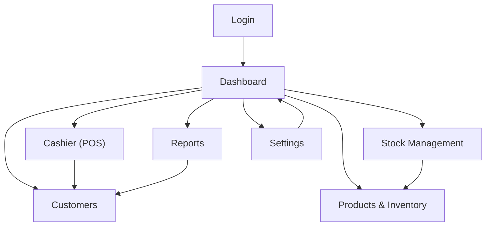

## 1. Product Overview
SimplePOS Pro is a web-based Point of Sale for modern retail stores focused on fast cashier flow (barcode scanning), flexible tier/wholesale pricing, accurate inventory, and customer loyalty/debt tracking.
It supports Admin and Cashier operations with role-based access.

## 2. Core Features

### 2.1 User Roles
| Role | Registration Method | Core Permissions |
|------|---------------------|------------------|
| Admin | Created by seeding or Admin user management | Full access: products, reports (incl. P&L), settings, user management |
| Cashier | Created by Admin | POS transactions, stock operations, customers (view/add/edit), no reports/settings/user management |

### 2.2 Feature Module
Our POS requirements consist of the following main pages:
1. **Login**: sign-in, store branding.
2. **Dashboard**: sales summary widgets, charts, top supplier.
3. **Cashier (POS)**: search/scan, cart, checkout, receipt print.
4. **Products & Inventory**: product list, create/edit products, category/brand master data, tier pricing.
5. **Stock Management**: stock in/out/opname, stock logs, suppliers.
6. **Customers**: customer list, details, loyalty points, debts.
7. **Reports**: daily sales, low/zero stock, receivables, P&L, supplier report.
8. **Settings**: store branding (name/icon/contact/receipt footer), sidebar behavior, user management (Admin).

### 2.3 Page Details
| Page Name | Module Name | Feature description |
|---|---|---|
| Login | Sign-in | Authenticate with email/username + password; redirect to app on success; block access when unauthenticated. |
| Login | Branding | Render store name + selected Lucide icon (from Settings) on the page. |
| Dashboard | KPI widgets | Show today’s sales total (paid only), low-stock count, total receivables (customers with debt), transaction trend chart, top supplier last 30 days by purchase value. |
| Dashboard | Navigation | Provide role-aware sidebar navigation; allow collapsing sidebar for cashier workspace (persist UI state). |
| Cashier (POS) | Product discovery | Search by name/SKU; support barcode scanner via focused input + Enter-to-add; filter by category; list/card toggle. |
| Cashier (POS) | Cart | Add/remove items, adjust quantity, compute subtotal; prevent quantity exceeding stock; show toast on add. |
| Cashier (POS) | Tier pricing | Auto-select best tier price by highest min_qty where qty >= min_qty; fallback to base price. |
| Cashier (POS) | Checkout | Select payment method (cash/QRIS/transfer/debt); quick cash buttons + “Exact”; compute change; allow partial payment (becomes debt). |
| Cashier (POS) | Debt rules | Require selecting/creating customer when outstanding_debt > 0 or method=debt; set status paid vs debt; set change=0 for debt/partial. |
| Cashier (POS) | Post-transaction | Save transaction + items; decrement stock; write stock logs; update loyalty points; update customer total_debt; show success + “Print receipt” + reset. |
| Products & Inventory | Product list | Search and filter by category/brand; show SKU, prices, stock, thresholds. |
| Products & Inventory | Product editor (Admin) | Create/edit product fields (name, SKU, buy/base prices, initial stock, min threshold); manage multi-tier pricing rows. |
| Products & Inventory | Type-to-create | Create new category/brand inline when typing a new value (persist to master data). |
| Stock Management | Stock logs | View history of stock changes with type (in/out/opname), prev/next stock, notes, timestamps. |
| Stock Management | Stock in | Add quantity with unit buy price; choose/create supplier; optional expiry date; persist as stock log. |
| Stock Management | Stock out | Decrease quantity for damage/returns; record note; persist as stock log. |
| Stock Management | Stock opname | Replace on-hand quantity to match physical count; persist prev/next stock as stock log. |
| Customers | Customer records | Create/edit customer (name, phone, address); view points and total debt. |
| Customers | Customer detail | Show transaction history, points history, and outstanding debts (from transactions status=debt). |
| Reports (Admin) | Sales daily | Filter by date; list transactions and totals. |
| Reports (Admin) | Stock alerts | List products with stock=0 or stock <= threshold. |
| Reports (Admin) | Receivables | List customers with total_debt > 0. |
| Reports (Admin) | Profit & loss | Compute total sales minus COGS (buy price * qty sold). |
| Reports (Admin) | Supplier report | Aggregate stock-in qty and purchase value per supplier with date filtering. |
| Settings (Admin) | Store branding | Set store name; choose curated Lucide icon (store Icon stored as string); set contact info and receipt footer text. |
| Settings (Admin) | User management | Create/update users and assign role (Admin/Cashier); prevent self-registration. |

## 3. Core Process
**Cashier flow**: Login → open POS → scan/search products → adjust cart → checkout (cash/QRIS/transfer/debt) → if debt/partial, pick/create customer → confirm → system saves transaction/items, reduces stock, updates points & debt → print receipt → reset for next customer.

**Admin flow**: Login → review dashboard KPIs → manage products (incl. tiers, category/brand) → perform stock in/out/opname and audit logs → manage customers and review debts → run reports (daily sales, low stock, receivables, P&L, supplier) → update store branding and manage users.

