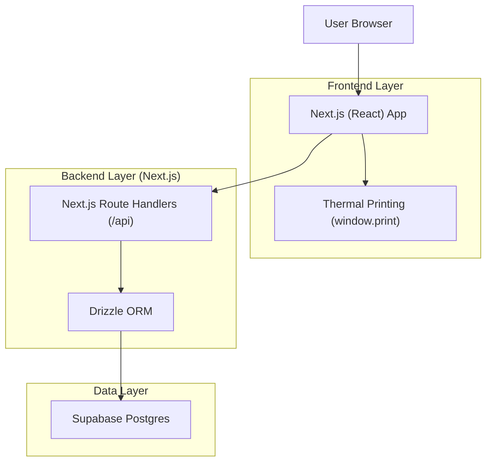
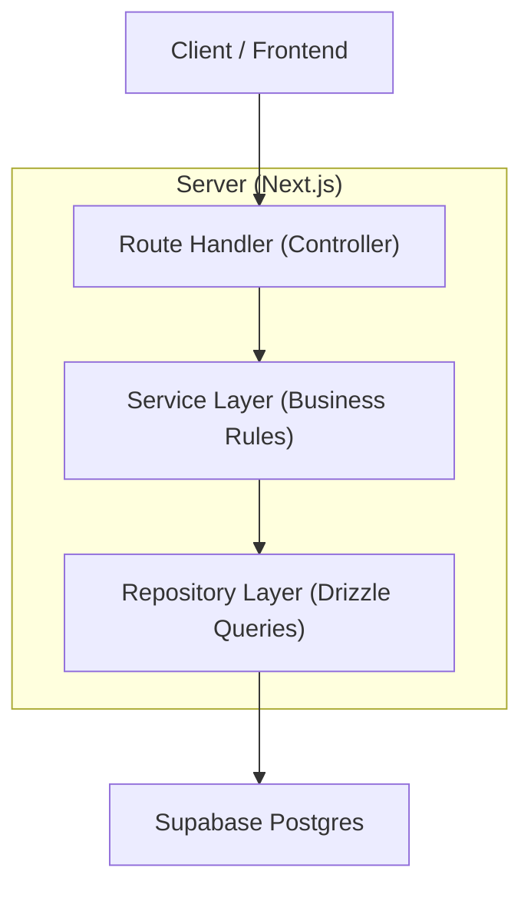
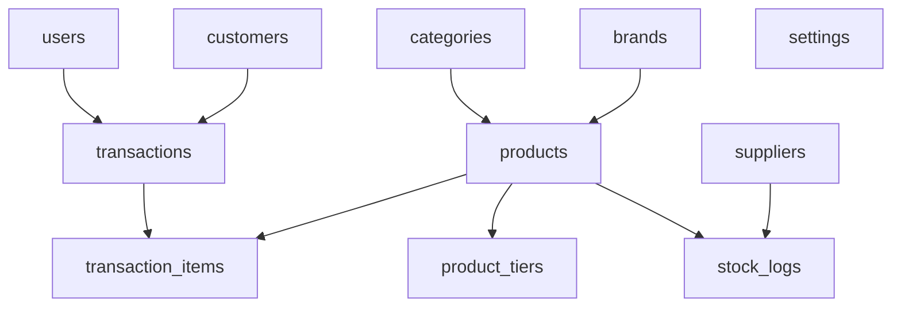

## 1.Architecture design


## 2.Technology Description
- Frontend: Next.js (App Router) + React@18 + tailwindcss + shadcn/ui + Zustand
- Backend: Next.js Route Handlers (server-only DB access)
- Database: Supabase (PostgreSQL)
- ORM: Drizzle ORM
- Auth: Better Auth (sessions + route protection)

## 3.Route definitions
| Route | Purpose |
|---|---|
| /login | Sign in and start session |
| / | Dashboard KPIs and navigation |
| /pos | Cashier POS flow (scan/search, cart, checkout, print) |
| /products | Product catalog and tier pricing (Admin create/edit) |
| /stock | Stock in/out/opname and stock logs |
| /customers | Customer management + detail (points, debts, history) |
| /reports | Admin reports (sales, low stock, receivables, P&L, supplier) |
| /settings | Branding (name/icon/contact/footer) + user management |

## 4.API definitions (If it includes backend services)
### 4.1 Shared types (TypeScript)
```ts
export type Role = 'admin' | 'cashier'
export type PaymentMethod = 'cash' | 'qris' | 'transfer' | 'debt'
export type TxStatus = 'paid' | 'debt'

export type CartItemInput = { productId: string; qty: number }

export type CheckoutRequest = {
  items: CartItemInput[]
  paymentMethod: PaymentMethod
  amountReceived?: number
  customerId?: string
}

export type CheckoutResponse = {
  transactionId: string
  totalAmount: number
  amountReceived: number
  change: number
  status: TxStatus
  outstandingDebt: number
  printable: {
    storeName: string
    storeIconName: string
    storeAddress?: string
    storePhone?: string
    receiptFooter?: string
  }
}
```

### 4.2 Core endpoints (summary)
- POST /api/auth/login, POST /api/auth/logout
- GET/POST/PATCH /api/products
- POST /api/stock/in | /api/stock/out | /api/stock/opname
- GET/POST /api/suppliers, GET/POST /api/customers
- POST /api/pos/checkout (validates stock, tier pricing, debt rules; writes transaction + stock logs)
- GET /api/reports/sales | /api/reports/stock-low | /api/reports/receivables | /api/reports/pnl | /api/reports/suppliers
- GET/POST /api/settings, GET/POST /api/users (Admin)

## 5.Server architecture diagram (If it includes backend services)


## 6.Data model(if applicable)
### 6.1 Data model definition (assumptions)
- Auth: Better Auth manages credentials/sessions; app stores role in `users`.
- No customer self-registration; users are created by Admin or seeded.
- Debt: stored as running total on customer + derived from transactions with status=debt.



### 6.2 Data Definition Language
```sql
-- Core tables (MVP). Add created_at/updated_at consistently.
CREATE TABLE users (
  id uuid PRIMARY KEY DEFAULT gen_random_uuid(),
  email text UNIQUE NOT NULL,
  name text NOT NULL,
  role text NOT NULL CHECK (role IN ('admin','cashier'))
);

CREATE TABLE categories (id uuid PRIMARY KEY DEFAULT gen_random_uuid(), name text UNIQUE NOT NULL);
CREATE TABLE brands (id uuid PRIMARY KEY DEFAULT gen_random_uuid(), name text UNIQUE NOT NULL);

CREATE TABLE products (
  id uuid PRIMARY KEY DEFAULT gen_random_uuid(),
  sku text UNIQUE NOT NULL,
  name text NOT NULL,
  category_id uuid NULL,
  brand_id uuid NULL,
  base_price int NOT NULL CHECK (base_price >= 0),
  buy_price int NOT NULL CHECK (buy_price >= 0),
  stock int NOT NULL CHECK (stock >= 0),
  min_stock_threshold int NOT NULL DEFAULT 0 CHECK (min_stock_threshold >= 0)
);

CREATE TABLE product_tiers (
  id uuid PRIMARY KEY DEFAULT gen_random_uuid(),
  product_id uuid NOT NULL,
  min_qty int NOT NULL CHECK (min_qty > 0),
  price int NOT NULL CHECK (price > 0),
  UNIQUE(product_id, min_qty)
);

CREATE TABLE customers (
  id uuid PRIMARY KEY DEFAULT gen_random_uuid(),
  name text NOT NULL,
  phone text NULL,
  address text NULL,
  points int NOT NULL DEFAULT 0 CHECK (points >= 0),
  total_debt int NOT NULL DEFAULT 0 CHECK (total_debt >= 0)
);

CREATE TABLE transactions (
  id uuid PRIMARY KEY DEFAULT gen_random_uuid(),
  customer_id uuid NULL,
  user_id uuid NOT NULL,
  total_amount int NOT NULL CHECK (total_amount >= 0),
  payment_method text NOT NULL CHECK (payment_method IN ('cash','qris','transfer','debt')),
  amount_received int NOT NULL DEFAULT 0 CHECK (amount_received >= 0),
  change int NOT NULL DEFAULT 0 CHECK (change >= 0),
  status text NOT NULL CHECK (status IN ('paid','debt'))
);

CREATE TABLE transaction_items (
  id uuid PRIMARY KEY DEFAULT gen_random_uuid(),
  transaction_id uuid NOT NULL,
  product_id uuid NOT NULL,
  qty int NOT NULL CHECK (qty > 0),
  price_at_transaction int NOT NULL CHECK (price_at_transaction >= 0),
  subtotal int NOT NULL CHECK (subtotal >= 0)
);

CREATE TABLE suppliers (id uuid PRIMARY KEY DEFAULT gen_random_uuid(), name text UNIQUE NOT NULL);

CREATE TABLE stock_logs (
  id uuid PRIMARY KEY DEFAULT gen_random_uuid(),
  product_id uuid NOT NULL,
  type text NOT NULL CHECK (type IN ('in','out','opname')),
  qty int NOT NULL CHECK (qty >= 0),
  prev_stock int NOT NULL CHECK (prev_stock >= 0),
  next_stock int NOT NULL CHECK (next_stock >= 0),
  supplier_id uuid NULL,
  unit_buy_price int NULL CHECK (unit_buy_price >= 0),
  expiry_date date NULL,
  note text NULL
);

CREATE TABLE settings (
  id uuid PRIMARY KEY DEFAULT gen_random_uuid(),
  store_name text NULL,
  store_icon_name text NULL,
  store_address text NULL,
  store_phone text NULL,
  receipt_footer text NULL
);

-- Security baseline: require authenticated app access; enforce role checks in API.
-- Optionally enable RLS + policies per table if connecting directly from client.
```
